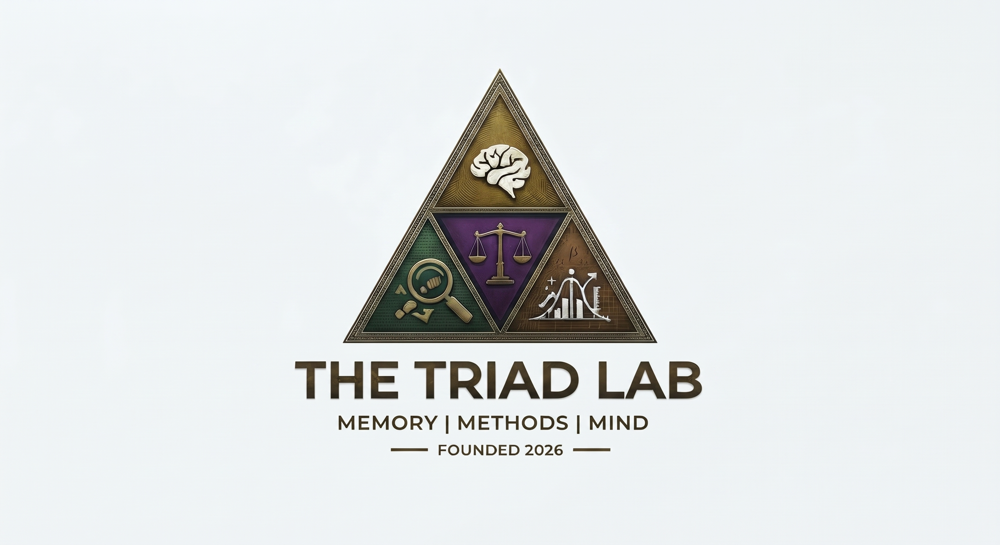

<style>
#title-block-header {
  display: none;
}
</style>

```{=html}
<div class="hero-banner-standalone">
  <div class="text-center">
    
    <div class="d-block">
      <div class="hero-badge">▲ Erasmus University Rotterdam • ESSB Forensic &amp; Legal Psychology ▲</div>
    </div>
    <h1 class="hero-title">The Triad Lab</h1>
    <div class="hero-subtitle">Memory &bull; Methods &bull; Mind</div>
    <p class="hero-desc">
      Welcome to <strong>The Triad Lab</strong>, led by <strong>Dr. Paul Riesthuis</strong> at the Erasmus School of Social and Behavioural Sciences (ESSB), Erasmus University Rotterdam. We investigate the cognitive architecture of memory, the psychological impacts of lying and deception, and develop advanced quantitative methodologies and simulation-based power analyses to elevate psychological and forensic science.
    </p>
    <div class="hero-buttons">
      <a href="research/index.qmd" class="btn-zelda-gold"><i class="bi bi-compass"></i> Explore Research</a>
      <a href="publications/index.qmd" class="btn-zelda-emerald"><i class="bi bi-journal-text"></i> Publications</a>
      <a href="posts/index.qmd" class="btn-zelda-outline"><i class="bi bi-code-slash"></i> R Analyses &amp; Code</a>
    </div>
  </div>
</div>

<div class="section-header-triforce">
  <div class="triforce-crest">
    <svg class="triforce-svg" viewBox="0 0 100 86.6" width="38" height="33" xmlns="http://www.w3.org/2000/svg">
      <defs>
        <linearGradient id="tfGrad1" x1="0%" y1="0%" x2="100%" y2="100%">
          <stop offset="0%" stop-color="#ffd700" />
          <stop offset="50%" stop-color="#e5b93b" />
          <stop offset="100%" stop-color="#c59b27" />
        </linearGradient>
      </defs>
      <polygon points="50,0 25,43.3 75,43.3" fill="url(#tfGrad1)" stroke="#8b6c16" stroke-width="1.5" />
      <polygon points="25,43.3 0,86.6 50,86.6" fill="url(#tfGrad1)" stroke="#8b6c16" stroke-width="1.5" />
      <polygon points="75,43.3 50,86.6 100,86.6" fill="url(#tfGrad1)" stroke="#8b6c16" stroke-width="1.5" />
    </svg>
  </div>
  <h2>The Three Pillars</h2>
  <p class="section-sub">Our research integrates cognitive mechanisms, advanced quantitative modeling, and legal-psychological applications.</p>
</div>

<div class="pillars-grid">
  <div class="pillar-card pillar-memory">
    <div class="pillar-icon-wrapper icon-memory">
      <i class="bi bi-search"></i>
    </div>
    <span class="badge-farore mb-2 align-self-start">Pillar I</span>
    <h3 class="pillar-title">Memory</h3>
    <p class="pillar-desc">
      Investigating eyewitness memory, false memories, autobiographical recall, and the cognitive consequences of lying, fabricated alibis, and denial-induced forgetting.
    </p>
    <a href="research/index.qmd#pillar-memory" class="stretched-link text-decoration-none fw-bold" style="color: #145a46;">Read More &rarr;</a>
  </div>

  <div class="pillar-card pillar-methods">
    <div class="pillar-icon-wrapper icon-methods">
      <i class="bi bi-graph-up-arrow"></i>
    </div>
    <span class="badge-triforce mb-2 align-self-start">Pillar II</span>
    <h3 class="pillar-title">Methods</h3>
    <p class="pillar-desc">
      Advancing quantitative methodology &amp; statistics: simulation-based power analysis for the Smallest Effect Size of Interest (SESOI), equivalence testing, and ROC curve analyses in R.
    </p>
    <a href="research/index.qmd#pillar-methods" class="stretched-link text-decoration-none fw-bold" style="color: #8b6c16;">Read More &rarr;</a>
  </div>

  <div class="pillar-card pillar-mind">
    <div class="pillar-icon-wrapper icon-mind">
      <i class="bi bi-lightbulb"></i>
    </div>
    <span class="badge-din mb-2 align-self-start">Pillar III</span>
    <h3 class="pillar-title">Mind</h3>
    <p class="pillar-desc">
      Examining the illusory truth effect, cognitive biases, how repetition increases perceived truth across facts and opinions, and judicial decision-making.
    </p>
    <a href="research/index.qmd#pillar-mind" class="stretched-link text-decoration-none fw-bold" style="color: #5e2781;">Read More &rarr;</a>
  </div>
</div>

<div class="section-header-triforce">
  <div class="triforce-crest">
    <svg class="triforce-svg" viewBox="0 0 100 86.6" width="38" height="33" xmlns="http://www.w3.org/2000/svg">
      <defs>
        <linearGradient id="tfGrad2" x1="0%" y1="0%" x2="100%" y2="100%">
          <stop offset="0%" stop-color="#ffd700" />
          <stop offset="50%" stop-color="#e5b93b" />
          <stop offset="100%" stop-color="#c59b27" />
        </linearGradient>
      </defs>
      <polygon points="50,0 25,43.3 75,43.3" fill="url(#tfGrad2)" stroke="#8b6c16" stroke-width="1.5" />
      <polygon points="25,43.3 0,86.6 50,86.6" fill="url(#tfGrad2)" stroke="#8b6c16" stroke-width="1.5" />
      <polygon points="75,43.3 50,86.6 100,86.6" fill="url(#tfGrad2)" stroke="#8b6c16" stroke-width="1.5" />
    </svg>
  </div>
  <h2>Latest Research</h2>
  <p class="section-sub">Recent peer-reviewed articles, tutorials, and registered reports from The Triad Lab.</p>
</div>

<div class="row g-4 mb-5 justify-content-center">
  <div class="col-lg-10">
    <div class="pub-card">
      <span class="badge-triforce mb-2 d-inline-block">Methods &amp; Statistics &bull; 2026</span>
      <div class="pub-title">
        <a href="https://doi.org/10.31234/osf.io/tsjgh_v1" target="_blank">Decisions Under Uncertainty: A Statistical Framework for Evaluating Practical Relevance in Interval-Based Hypothesis Testing</a>
      </div>
      <div class="pub-authors"><strong>Riesthuis, P.</strong>, Cribbie, R. A., Celio, V., &amp; Beribisky, N. (2026)</div>
      <div class="pub-journal">Behavior Research Methods (Accepted)</div>
      <p style="font-size: 0.93rem; color: #495057; margin-bottom: 0.6rem;">
        A comprehensive statistical framework and simulation methodology evaluating interval-based hypothesis testing and practical relevance under empirical uncertainty.
      </p>
      <div class="pub-links">
        <a href="https://doi.org/10.31234/osf.io/tsjgh_v1" class="pub-btn pub-btn-doi" target="_blank"><i class="bi bi-box-arrow-up-right"></i> DOI: 10.31234/osf.io/tsjgh_v1</a>
      </div>
    </div>

    <div class="pub-card">
      <span class="badge-din mb-2 d-inline-block">Mind &amp; Illusory Truth &bull; 2026</span>
      <div class="pub-title">
        <a href="https://doi.org/10.1016/j.concog.2026.104119" target="_blank">Limits of the Illusory Truth Effect for Social-Political Opinions: Evidence from Two Experiments and a Mini Meta-Analysis</a>
      </div>
      <div class="pub-authors"><strong>Riesthuis, P.</strong>, &amp; Woods, J. (2026)</div>
      <div class="pub-journal">Consciousness and Cognition, 144, 104119</div>
      <div class="pub-links">
        <a href="https://doi.org/10.1016/j.concog.2026.104119" class="pub-btn pub-btn-doi" target="_blank"><i class="bi bi-box-arrow-up-right"></i> DOI: 10.1016/j.concog.2026.104119</a>
      </div>
    </div>

    <div class="pub-card">
      <span class="badge-triforce mb-2 d-inline-block">Methods &amp; SESOI &bull; 2024</span>
      <div class="pub-title">
        <a href="https://doi.org/10.1177/25152459241240722" target="_blank">Simulation-Based Power Analyses for the Smallest Effect Size of Interest: A Confidence Interval Approach for Minimum-Effect and Equivalence Testing</a>
      </div>
      <div class="pub-authors"><strong>Riesthuis, P.</strong> (2024)</div>
      <div class="pub-journal">Advances in Methods and Practices in Psychological Science (AMPPS), 7(2)</div>
      <div class="pub-links">
        <a href="https://doi.org/10.1177/25152459241240722" class="pub-btn pub-btn-doi" target="_blank"><i class="bi bi-box-arrow-up-right"></i> DOI: 10.1177/25152459241240722</a>
        <a href="https://osf.io/nzupw/" class="pub-btn pub-btn-osf" target="_blank"><i class="bi bi-code-square"></i> OSF Code &amp; Data</a>
      </div>
    </div>

    <div class="text-center mt-4">
      <a href="publications/index.qmd" class="btn-zelda-gold"><i class="bi bi-journal-text"></i> View All Publications &rarr;</a>
    </div>
  </div>
</div>
```

::: {.callout-note appearance="simple"}
### ▲ Open Science Commitment
At **The Triad Lab**, we believe in transparent, reproducible, and cumulative science. All data, R scripts, simulation code, and preprints are freely available under Open Science framework principles. Explore our code and materials in the [R Analyses section](posts/index.qmd) or on [GitHub](https://github.com/PaulRiesthuis).
:::
