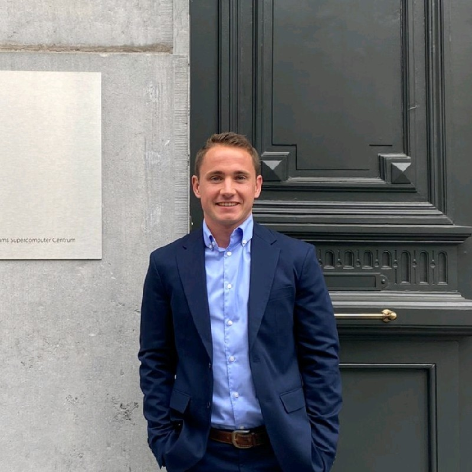

```{=html}
<div class="section-header-triforce">
  <div class="triforce-crest">
    <svg class="triforce-svg" viewBox="0 0 100 86.6" width="38" height="33" xmlns="http://www.w3.org/2000/svg">
      <defs>
        <linearGradient id="tfGradTeam1" x1="0%" y1="0%" x2="100%" y2="100%">
          <stop offset="0%" stop-color="#ffd700" />
          <stop offset="50%" stop-color="#e5b93b" />
          <stop offset="100%" stop-color="#c59b27" />
        </linearGradient>
      </defs>
      <polygon points="50,0 25,43.3 75,43.3" fill="url(#tfGradTeam1)" stroke="#8b6c16" stroke-width="1.5" />
      <polygon points="25,43.3 0,86.6 50,86.6" fill="url(#tfGradTeam1)" stroke="#8b6c16" stroke-width="1.5" />
      <polygon points="75,43.3 50,86.6 100,86.6" fill="url(#tfGradTeam1)" stroke="#8b6c16" stroke-width="1.5" />
    </svg>
  </div>
  <h2>Principal Investigator</h2>
  <p class="section-sub">Leading research on memory mechanisms, deceptive cognition, psychometrics, and the illusory truth effect at Erasmus University Rotterdam.</p>
</div>
```

::: {.row .justify-content-center .mb-5}
::: {.col-lg-10}
::: {.team-card}
::: {.row .align-items-center}
::: {.col-md-4 .text-center .mb-4 .mb-md-0}

<h3 style="margin-bottom: 0.2rem; font-size: 1.45rem;">Dr. Paul Riesthuis</h3>
<div class="badge-triforce d-inline-block mb-2">Lab Director &bull; Researcher / Assistant Professor</div>
<div class="text-muted" style="font-size: 0.92rem;">Erasmus School of Social and Behavioural Sciences (ESSB)<br>Forensic &amp; Legal Psychology<br><strong>Erasmus University Rotterdam</strong></div>

<div class="d-flex justify-content-center gap-2 mt-3">
  <a href="mailto:paul.riesthuis@kuleuven.be" class="btn btn-sm btn-outline-dark" title="Email"><i class="bi bi-envelope-fill"></i></a>
  <a href="https://scholar.google.be/citations?user=5gVs6QMAAAAJ" target="_blank" class="btn btn-sm btn-outline-dark" title="Google Scholar"><i class="bi bi-mortarboard-fill"></i></a>
  <a href="https://github.com/PaulRiesthuis" target="_blank" class="btn btn-sm btn-outline-dark" title="GitHub"><i class="bi bi-github"></i></a>
  <a href="https://www.researchgate.net/profile/Paul-Riesthuis-2" target="_blank" class="btn btn-sm btn-outline-dark" title="ResearchGate"><i class="bi bi-journal-richtext"></i></a>
  <a href="https://www.linkedin.com/in/paul-riesthuis-631323224/" target="_blank" class="btn btn-sm btn-outline-dark" title="LinkedIn"><i class="bi bi-linkedin"></i></a>
</div>
:::

::: {.col-md-8}
<h4 style="font-family: 'Cinzel', serif; color: #145a46;">Biography &amp; Academic Focus</h4>
<p style="text-align: justify; font-size: 0.98rem; line-height: 1.75; color: #374151;">
Dr. Paul Riesthuis is based at the <strong>Erasmus School of Social and Behavioural Sciences (ESSB)</strong>, in the <strong>Forensic and Legal Psychology</strong> section at <strong>Erasmus University Rotterdam</strong>. His research explores the cognitive architecture of memory, the consequences of deceptive strategies (such as fabrication, false alibis, and denial-induced forgetting), and the illusory truth effect.
</p>
<p style="text-align: justify; font-size: 0.98rem; line-height: 1.75; color: #374151;">
In addition to cognitive experimentation, he develops advanced quantitative methodologies in <strong>R</strong> for simulation-based power analysis, equivalence testing, Receiver Operating Characteristic (ROC) curve modeling, and the <strong>Smallest Effect Size of Interest (SESOI)</strong> to advance reproducibility and practical inference across psychological and legal disciplines.
</p>

<h5 style="font-family: 'Cinzel', serif; margin-top: 1.3rem; font-size: 1.08rem;">Education &amp; Academic Background</h5>
<ul class="list-unstyled" style="font-size: 0.92rem; line-height: 1.85;">
  <li><i class="bi bi-mortarboard text-warning"></i> <strong>PhD in Criminological Sciences</strong> &bull; KU Leuven (2023)</li>
  <li><i class="bi bi-mortarboard text-warning"></i> <strong>PhD in Psychology and Cognitive Neuroscience</strong> &bull; Maastricht University (2023)</li>
  <li><i class="bi bi-mortarboard text-success"></i> <strong>M.Sc. in Brain and Cognition</strong> &bull; Pompeu Fabra University (2017)</li>
  <li><i class="bi bi-mortarboard text-info"></i> <strong>B.A. in Psychology</strong> &bull; Grand View University (2016)</li>
</ul>
:::
:::
:::
:::
:::

```{=html}
<div class="section-header-triforce">
  <div class="triforce-crest">
    <svg class="triforce-svg" viewBox="0 0 100 86.6" width="38" height="33" xmlns="http://www.w3.org/2000/svg">
      <defs>
        <linearGradient id="tfGradTeam2" x1="0%" y1="0%" x2="100%" y2="100%">
          <stop offset="0%" stop-color="#ffd700" />
          <stop offset="50%" stop-color="#e5b93b" />
          <stop offset="100%" stop-color="#c59b27" />
        </linearGradient>
      </defs>
      <polygon points="50,0 25,43.3 75,43.3" fill="url(#tfGradTeam2)" stroke="#8b6c16" stroke-width="1.5" />
      <polygon points="25,43.3 0,86.6 50,86.6" fill="url(#tfGradTeam2)" stroke="#8b6c16" stroke-width="1.5" />
      <polygon points="75,43.3 50,86.6 100,86.6" fill="url(#tfGradTeam2)" stroke="#8b6c16" stroke-width="1.5" />
    </svg>
  </div>
  <h2>Collaborators &amp; Research Network</h2>
  <p class="section-sub">We collaborate with international scholars across cognitive psychology, psychometrics, and legal sciences.</p>
</div>
```

::: {.row .g-4 .mb-5}
::: {.col-md-4}
::: {.card .p-3 .h-100 style="border-radius: 12px;"}
<h5><i class="bi bi-people text-success"></i> Cognitive &amp; Legal Psychology</h5>
<p style="font-size: 0.93rem; color: #495057;">
Active research collaborations on memory distortion, fabrication inflation, eyewitness identification, and forensic interviews with international colleagues.
</p>
:::
:::

::: {.col-md-4}
::: {.card .p-3 .h-100 style="border-radius: 12px;"}
<h5><i class="bi bi-calculator text-warning"></i> Quantitative Methods &amp; SESOI</h5>
<p style="font-size: 0.93rem; color: #495057;">
Collaborative development of minimum-effect testing, equivalence testing, and confidence interval power simulation packages with psychometricians and methodology experts.
</p>
:::
:::

::: {.col-md-4}
::: {.card .p-3 .h-100 style="border-radius: 12px;"}
<h5><i class="bi bi-globe text-info"></i> Open Science &amp; Registered Reports</h5>
<p style="font-size: 0.93rem; color: #495057;">
Leading and contributing to international Registered Reports and meta-analyses adhering to open science and pre-registration principles.
</p>
:::
:::
:::

::: {.section-header-triforce}
<div class="triforce-crest">▲ ▲ ▲</div>
<h2>Join The Triad Lab</h2>
<p class="section-sub">We welcome inquiries from prospective researchers and students passionate about memory, statistics, and legal psychology.</p>
:::

::: {.row .justify-content-center}
::: {.col-lg-10}
::: {.card .p-4 style="background: linear-gradient(135deg, rgba(20,90,70,0.06), rgba(197,155,39,0.06)); border: 1px solid rgba(197,155,39,0.35); border-radius: 14px;"}
<h4><i class="bi bi-mortarboard-fill text-warning"></i> Student &amp; Postdoc Opportunities</h4>
<p style="font-size: 1rem; line-height: 1.7;">
Are you interested in memory research, statistical simulations in R, or legal psychology? We welcome inquiries from:
</p>
<ul style="font-size: 0.96rem; line-height: 1.85;">
  <li><strong>Master's Thesis Students:</strong> Conduct experimental research or statistical simulation studies on eyewitness memory, deception, or power analysis at Erasmus University Rotterdam.</li>
  <li><strong>PhD Candidates &amp; Postdoctoral Fellows:</strong> Co-develop grant proposals (e.g. NWO, MSCA) or collaborate on pre-registered laboratory experiments.</li>
  <li><strong>Research Interns:</strong> Gain hands-on experience with R data analysis, psychometrics, and experimental designs.</li>
</ul>
<div class="mt-3">
  <a href="../contact/index.qmd" class="btn-zelda-gold">Get in Touch with the Lab &rarr;</a>
</div>
:::
:::
:::
